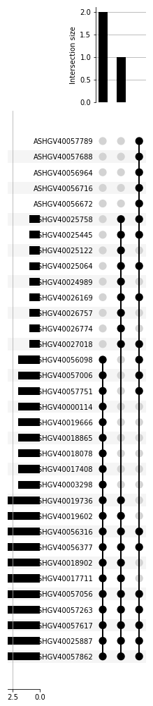
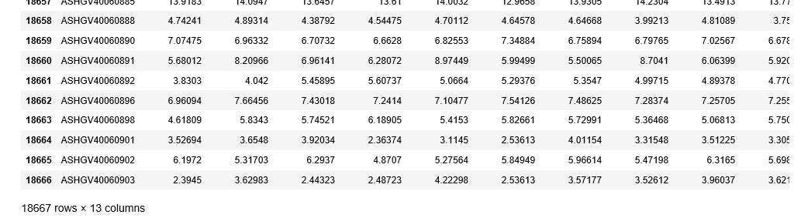

ERgene
======
This is a python library to Find Candidate reference gene

Where to get it
------
Binary installers for the latest released version are available at the pypi

	#PyPI
	pip install ERgene

Dependencies
------
- Numpy
- time
- pandas
- itertools
- upsetplot

See the full installation instructions for minimum supported versions of required, recommended and optional dependencies

Example
------

### How to Find reference genes ###

**input**

	import ERgene
	import pandas as pd
	data=pd.read_csv('gse.txt',sep='\t')#GSE125792
	ERgene.FindERG(data,3)

**output**

	calculate time:57.62s
	['ASHGV40057862', 'ASHGV40057056', 'ASHGV40025887', 'ASHGV40056316', 'ASHGV40056377', 'ASHGV40057617', 'ASHGV40057263']

if you use jupyter notebook, there is an Upsetplot will be generated.

### How to normalizationdata ###
You only need to input the gene to normalizate. 

**However, the literature has proved that single gene standardization is not desirable, so this method should be used with Caution!!!**

**input**

	ans=ERgene.normalizationdata(data,'ASHGV40056316')
	print(ans)

**output**

License
------
MIT
